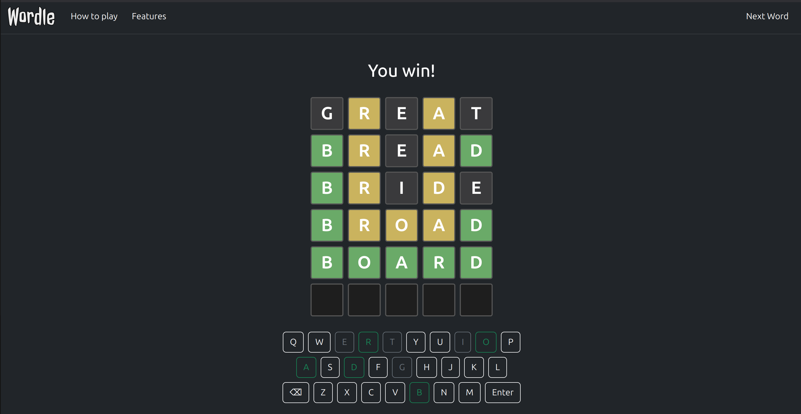

# 🎮 Wordle Clone – Browser Game

A fun and responsive Wordle-style word guessing game built with **HTML, CSS, and JavaScript**.

## 🚀 Features

- 🎯 Guess a **5-letter word** in **6 tries**
- 🟩 **Green** – correct letter, correct position  
- 🟨 **Yellow** – correct letter, wrong position  
- ⬜ **Gray** – incorrect letter  
- 🎹 Supports both **keyboard** and **on-screen keyboard** input  
- 🌓 Dark mode UI using **Bootstrap 5**  
- 🔄 Replay any time with the **"Next Word"** button  
- 🧠 Hidden **cheat** feature to reveal the word (for debugging)

## 🔧 Developer Notes

- Words are randomly picked from a 2000+ word list.
- Key buttons light up according to guess results.
- A hidden element (`#cheat`) in the navbar can reveal the current word.
- Clean, modular functions make the code easy to read and extend.

---

